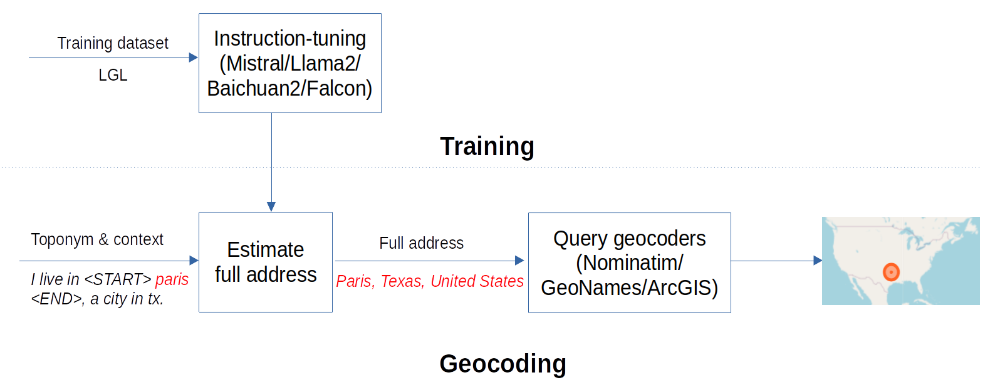

# LLM-geocoding
This is the code for fine-tuning Mistral, llama2, Baichuan2, and Falcon for geocoding or toponym resolution tasks. These models are fine-tuned to accurately estimate toponyms' unambiguous references or full addresses (e.g., city, state, country), subsequently determining their geo-coordinates via geocoders, as shown in the figure below.

<p align="center">
<a href="url">
 </a>
</p>

## Fine-tuning
### Mistral and Llama2
```shell
OUT='lora_weights_save_dir'
mkdir $OUT
python finetune_llm.py \
       --data_file "data/training_data.json" \
       --R 16 \
       --batch 32 \
       --ALPHA 16 \
       --dropout 0.1 \
       --BASE_MODEL "kittn/mistral-7B-v0.1-hf" \
       --OUTPUT_DIR=$OUT \
       --LEARNING_RATE 3e-3 \
       --neftune_noise_alpha 0.1 \
       --TRAIN_STEPS 500
```
### Baichuan2
Download [Baichuan2](https://github.com/baichuan-inc/Baichuan2/tree/main) project and replace the fine-tune.py file with the provided fine-tune.py file in this project.
```shell

OUT='lora_weights_save_dir'
mkdir $OUT
hostfile=""
deepspeed --hostfile=$hostfile fine-tune.py  \
    --report_to "none" \
    --data_path "data/training_data_baichuan.json" \
    --model_name_or_path "baichuan-inc/Baichuan2-7B-Base" \
    --output_dir $OUT \
    --model_max_length 512 \
    --per_device_train_batch_size 32 \
    --gradient_accumulation_steps 1 \
    --max_steps 500 \
    --save_strategy 'steps' \
    --learning_rate 3e-3 \
    --save_steps 2 \
    --eval_steps 2 \
    --lr_scheduler_type constant \
    --adam_beta1 0.9 \
    --adam_beta2 0.98 \
    --adam_epsilon 1e-8 \
    --max_grad_norm 1.0 \
    --weight_decay 1e-4 \
    --warmup_ratio 0.0 \
    --logging_steps 2 \
    --gradient_checkpointing True \
    --deepspeed ds_config.json \
    --bf16 True \
    --tf32 True \
    --use_lora True \
```
### Falcon
```shell
Out='lora_weights_save_dir'
mkdir $Out
python finetune/lora.py --checkpoint_dir checkpoints/tiiuae/falcon-7b \
                        --data_dir data/7  \
                        --out_dir $Out  \
                        --device 1  \
                        --precision bf16-true  \
```


## Fine-Tuned Models

We have provided the fine-tuned models (LoRA weights) for your convenience. The available models are:

- **[Mistral-7B](https://huggingface.co/xukehu/Mistral-7B-LoRA-Toponym-Resolution)**
- **[Llama2-7B](https://huggingface.co/xukehu/Llama2-7B-LoRA-Toponym-Resolution)**
- **[Llama2-13B](https://huggingface.co/xukehu/Llama2-13B-LoRA-Toponym-Resolution)**
- **[Baichun2-7B](https://huggingface.co/xukehu/Mistral-7B-LoRA-Toponym-Resolution)**
- **[Falcon-7B](https://huggingface.co/xukehu/Mistral-7B-LoRA-Toponym-Resolution)**


## Generation or Prediction
unzip the [test_data.zip](data/test_data.zip) file.

```shell
BASE_MODEL="kittn/mistral-7B-v0.1-hf"
LORA_WEIGHTS="path_of_the_lora_weights" 
python prediction.py \
    --load_8bit False\
    --base_model "$BASE_MODEL" \
    --lora_weights "$LORA_WEIGHTS" \
```
## Citation

If you use the code or data, please cite the following publication:

```bibtex
@article{hu2024toponym,
  title={Toponym resolution leveraging lightweight and open-source large language models and geo-knowledge},
  author={Hu, Xuke and Kersten, Jens and Klan, Friederike and Farzana, Sheikh Mastura},
  journal={International Journal of Geographical Information Science},
  pages={1--28},
  year={2024},
  publisher={Taylor & Francis}
}
```
